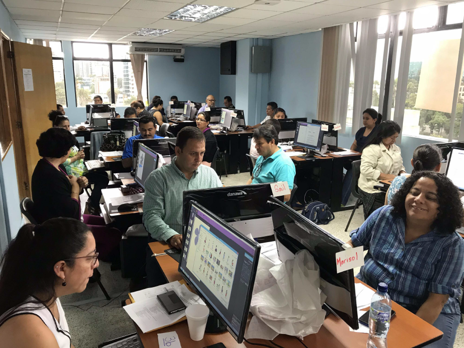
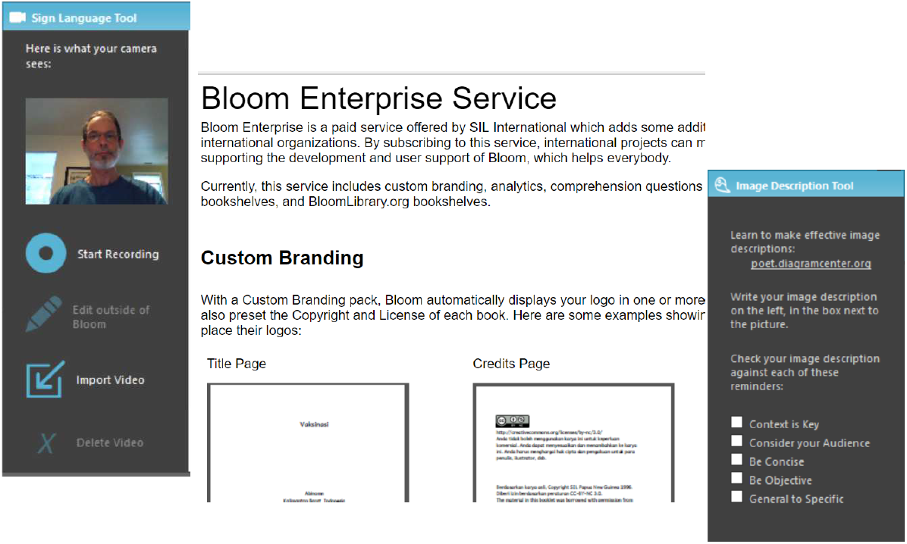

# Learning to Use Bloom Enterprise

## Introducing Bloom Enterprise

## What is Bloom Enterprise
What is Bloom Enterprise?
Bloom is free software from SIL International. Bloom Enterprise is a paid service offered by SIL LEAD which adds some additional features and services that are important to international organizations. By subscribing to this service, international projects can meet some of their unique needs while also supporting the development and user support of Bloom, which helps everybody.
These materials assume that you already have a subscription. If you don't, please visit
https://www.sil-lead.org/bloom-enterprise/

:::tip

Speaking of Enterprise, have you seen Star Trek "Strange New Worlds"?

:::

If you have not selected your Bloom Enterprise subscription in the Collection Settings, you will see a notice if you try to use the **Image Description Tool**, **Impairment Visualizer**, **Sign Language Tool**, or **Bloom Reader Quiz Page**. Once you select or enter your subscription information in the Collection Settings, these tools will be activated. In this training course you will learn how to use each of these tools.

## How do I select my Bloom Enterprise subscription?

To activate your Bloom Enterprise subscription, go to **Settings** and click on the **Bloom Enterprise** tab. Select the Enterprise Subscription button and type or paste in your
Subscription Code. Bloom will need to restart after you make this change. After Bloom restarts, the features that were “locked” will be available to you to use.

