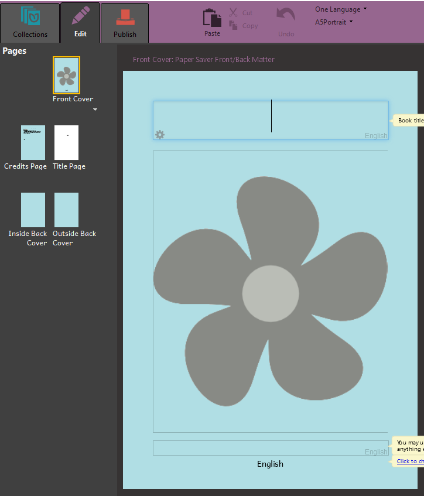

# The Edit Tab

When you double-click on a book, it opens up in the **Edit tab**. You will see all the pages at the left hand side, and the page currently being edited in the main part of the screen.

On the left side are the thumbnails of all the pages in the book.

On the right side is the page currently being edited, in the main part of the screen. Anywhere you see an empty box, that is a place to type. If you see the picture of a flower, that is place to put an image.
